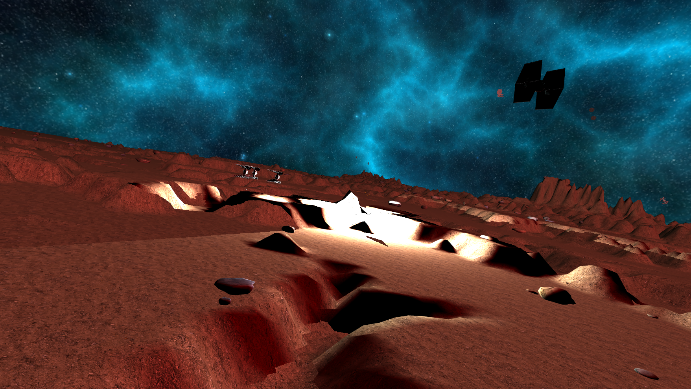

A demo of a space battle using WebGL.

This project was implemented by [@brusteca](https://github.com/brusteca) and [@federivero](https://github.com/federivero) for the 2017 Advanced Computer Graphics class at FIng, UdelaR.

## How to run

Download the code, run a web server on the directory ([you can use something simple like Chrome 200 OK](https://chrome.google.com/webstore/detail/web-server-for-chrome/ofhbbkphhbklhfoeikjpcbhemlocgigb?hl=en)), and open `/main.html`.

Use W, A to move, Q, E to roll, arrow keys to pitch, and space bar to shoot.

## Screenshots

